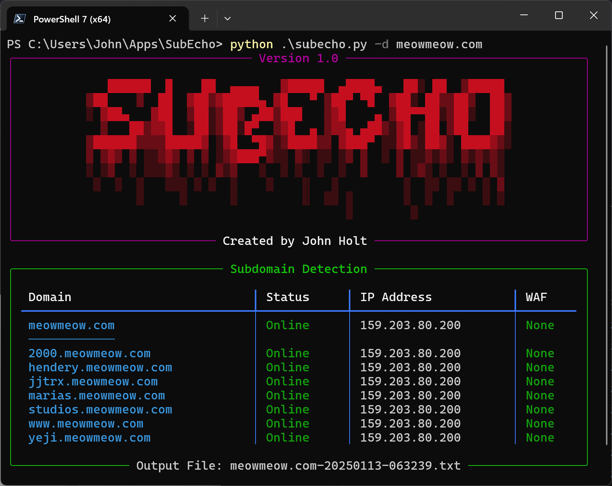

# SubEcho: Cross-Platform Subdomain Enumeration & WAF Detection


---
## Overview
***SubEcho*** is a cross-platform subdomain enumeration and WAF detection tool written in Python. It queries multiple data sources (crt.sh, SecurityTrails, RapidDNS, WebArchive, AlienVault OTX, HackerTarget, and urlscan.io) to discover subdomains, checks if they’re down, and attempts to detect if a subdomain is behind a known WAF (Web Application Firewall).

> **Author**: John Holt
---

## Screenshot

---

## Features
* Enumerates subdomains from various well-nown data sources
* Distinguishes between *online* and *offline* subdomains
* Scans for *WAF* signatures in headers and cookies
* Saves results to a *timestamped file* for easy reference
* Provides optional *verbose logs* for troubleshooting
---

## Requirements
-  **Python 3.7**
-  **PIP** (the standard Python package manager)
---

## Installation
1.  **Clone the repository**:
```bash
git clone https://github.com/john-holt4/SubEcho.git
cd SubEcho
```

2. **Install Python dependencies**:
```bash
pip install -r requirements.txt
```

- [aiohttp](https://pypi.org/project/aiohttp/) — for asynchronous HTTP requests
- [rich](https://pypi.org/project/rich/) — for beautiful console output
 
3.  *(Optional) SecurityTrails API key*:
If you have a [SecurityTrails](https://securitytrails.com/) account, pass the API key via `-k YOUR_API_KEY` to *unlock deeper subdomain discovery*. Otherwise, that source is skipped.
---

## Usage
Run the tool using Python:
```{bash}
ptyhon subecho.py -d example.com
```
Where `example.com` is your target domain.

### Arguments
-  `-d, --domain` [**Required**]
The target domain, e.g. `-d example.com`
-  `-k, --apikey` *(Optional)*
A [SecurityTrails](https://securitytrails.com/) API key for additional subdomain data
-  `-v, --verbose` 
Enable verbose mode for debug info

### Examples
1.  **Basic usage**:
```bash
python subecho.py -d example.com
```
2.  **Enable verbose mode**:
```bash
python subecho.py -d example.com -v
```
3. **Use SecurityTrails**:
```bash
python subecho.py -d example.com -k YOUR_API_KEY
```
---

## How It Works
1.  **Banner & Validation**
* Displays a banner and validates the main domain format.
2.  **Subdomain Enumeration**
* Gathers subdomains from multiple sources (CRT.sh, RapidDNS, etc.)
3.  **Online/Offline Check**
* Attempts DNS resolution for each discovered subdomain.
4.  **WAF Detection**
- For subdomains that resolve, sends HTTP(S) requests to detect known WAF signatures.
5.  **Save & Display Results**
* Outputs a Rich-formatted table in the console
* Saves results to a `.txt` file with a timestamp (e.g. `example.com-20250113-120000.txt`)
----

## Contributing
1.  **Fork** this project
2. Create your feature branch: `git checkout -b my-new-feature`
3. Commit your changes: `git commit -am 'Add new feature'`
4. Push to the branch: `git push origin my-new-feature`
5. Create a new **Pull Request** on GitHub
---

## License
This repository is licensed under [MIT License](https://github.com/john-holt4/SubEcho/blob/main/LICENSE). See `LICENSE` for details.

Made with :heart: and Python